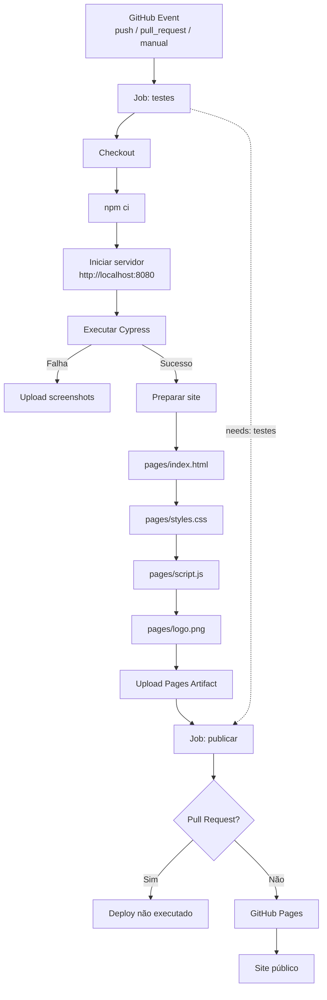

# Quiz Cypress

Desafia-se neste quiz que avalia seus conhecimentos em CYPRESS.


## O jogo

Um quiz simples com 20 perguntas de múltipla escolha. A cada resposta, o jogo mostra se você acertou ou errou, soma a pontuação e, ao final, exibe uma mensagem de acordo com o resultado.

## Tecnologias

- *HTML, CSS e JavaScript* - Contruindo a página
- *http-server* — servidor local simples, usado só para servir o jogo durante os testes
- *Cypress* — framework de testes end-to-end
- *GitHub Actions* — roda os testes automaticamente a cada push


## Fluxo



## Estrutura do projeto

```bash
quiz-cypress/
├── game/ # Página HTML do QUIZ
│   ├── assets
│   │   ├── logo.png
│   │   ├── script.js
│   │   └── styles.css
│   └── index.html
├── cypress/e2e/quiz.cy.js  # Casos de teste
├── cypress.config.js
├── package.json
├── .github/workflows/tests.yml # CI/CD
└── README.md # Documentação
```

## O que está sendo testado

| # | Caso de teste | Tipo |
|---|---|---|
| CT01 | Carregar o quiz deve exibir a primeira pergunta e 4 opções | Positivo |
| CT02 | Responder corretamente deve exibir mensagem de acerto | Positivo |
| CT03 | Responder incorretamente deve exibir a resposta certa | Negativo |
| CT04 | Concluir todas as 20 perguntas deve exibir a tela de resultado | Positivo |
| CT05 | Acertar todas as perguntas deve exibir mensagem de nota máxima | Positivo |
| CT06 | Errar todas as perguntas deve exibir mensagem de incentivo | Negativo |
| CT07 | Botão "Jogar novamente" deve reiniciar o quiz do zero | Positivo |

## Como rodar na sua máquina

Pré-requisito: [Node.js](https://nodejs.org) instalado.

```bash
# 1. Clonar o repositório
git clone git@github.com:horadoqa/quiz-cypress.git

# 2. Abrir o diretório
cd quiz-cypress

# 3. Instalar as dependências
npm install

# 4. Rodar os testes (sobe o servidor e roda o Cypress automaticamente)
npm test

# 5. Resultado
Quiz de Cypress
    ✓ CT01 - Carregar o quiz deve exibir a primeira pergunta e 4 opções (409ms)
    ✓ CT02 - Responder corretamente deve exibir mensagem de acerto (337ms)
    ✓ CT03 - Responder incorretamente deve exibir a resposta certa (227ms)
    ✓ CT04 - Concluir todas as 20 perguntas deve exibir a tela de resultado (3756ms)
    ✓ CT05 - Acertar todas as perguntas deve exibir mensagem de nota máxima (3662ms)
    ✓ CT06 - Errar todas as perguntas deve exibir mensagem de incentivo (3728ms)
    ✓ CT07 - Botão "Jogar novamente" deve reiniciar o quiz do zero (3261ms)


  7 passing (16s)
```